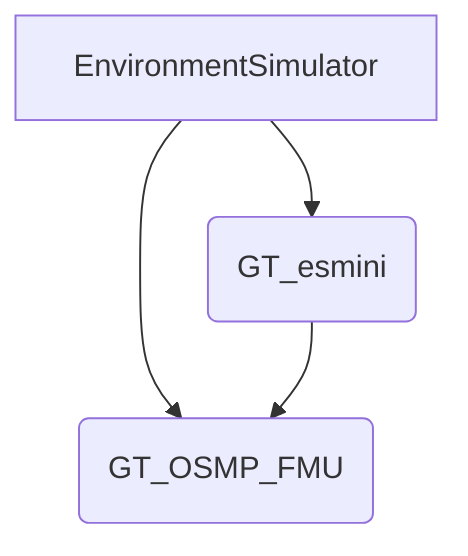

# Repository Knowledge Graph: GT_esmini

This document defines the structural context, dependencies, and operational rules for the `GT_esmini` repository.

## 1. Top-Level Structure

### **Roots**
- **Repository Root**: `e:\Repository\GT_esmini\esmini`
- **Core Engine**: `EnvironmentSimulator` (Vanilla esmini)
- **Extension Module**: `GT_esmini` (Custom Logic)

### **Directory Responsibilities**

| Directory | Role | AI Strategy |
| :--- | :--- | :--- |
| **`EnvironmentSimulator/`** | **Upstream Core**. Contains the vanilla esmini source code (`esminiLib`, `RoadManager`, `Applications`). | **READ-ONLY (Strict)**. Treat as an external dependency. Do not modify unless absolutely necessary for linking/binding. |
| **`GT_esmini/`** | **Extension Scope**. Contains all custom logic (`RealVehicle`, `AutoLight`, `OSIReporter`). | **ACTIVE Development**. All new features, logic changes, and fixes must reside here. |
| **`GT_OSMP_FMU/`** | **Integration Wrapper**. Wrapper to build `GT_esmini` as a Functional Mock-up Unit (FMU). | **Build Target**. Depends on `GT_esmini` libraries. |
| **`OSMP_FMU/`** | **Reference Wrapper**. Vanilla esmini FMU wrapper. | **Reference**. Use for comparison/debugging only. |
| **`resources/`** | **Assets**. `xodr` (OpenDRIVE), `xosc` (OpenSCENARIO), Models. | **Input Data**. If simulation fails, assume Code Bug > Asset Bug. |
| **`scripts/`** | **Utilities**. Python scripts, tools. | **Support**. |

## 2. Operational Rules (Directives)

### **R1: Clean Core Policy**
- **Constraint**: `EnvironmentSimulator` and `OSMP_FMU` MUST remain pristine.
- **Action**: Reject requests to modify core files to support new features. Implement wrappers or hooks in `GT_esmini` instead.

### **R2: Extension First Policy**
- **Constraint**: innovative logic resides in `GT_esmini`.
- **Action**: When implementing a feature (e.g., new sensor, control logic), create new files in `GT_esmini/` or modify existing `GT_*` files.

### **R3: Implementation Validation Bias**
- **Constraint**: `resources` assets are trusted.
- **Action**: On simulation error (crash, unexpected behavior), prioritize debugging `GT_esmini` C++ code over modifying `xosc`/`xodr` files.

## 3. Build System & Dependency Graph

### **Build Context**
- **System**: CMake
- **Toolchain**: Visual Studio 2022 (Windows), GCC/Clang (Linux)

### **Dependency Graph**

*Note: `GT_esmini` is built as a subdirectory of the root project, effectively extending `EnvironmentSimulator` but physically separated.*

### **Build Protocols**

#### **Protocol A: Main Project (Core + Extension)**
- **Scope**: `esmini`, `GT_Sim`, `GT_esminiLib`
- **Root**: Repository Root (`.`)
- **Command**:
  ```powershell
  cmake -S . -B build -G "Visual Studio 17 2022" -A x64
  cmake --build build --config Release
  ```
- **Output**: `build/GT_esmini/Release/GT_esminiLib.dll`

#### **Protocol B: FMU Export (Integration)**
- **Scope**: `esmini.fmu` (with GT extensions)
- **Root**: `GT_OSMP_FMU/`
- **Pre-condition**: Protocol A must be completed (Artifact dependency).
- **Command**:
  ```powershell
  cd GT_OSMP_FMU
  mkdir build; cd build
  cmake .. -G "Visual Studio 17 2022" -A x64
  cmake --build . --config Release
  ```
- **Output**: `GT_OSMP_FMU/build/esmini.fmu`

## 4. Contextual Links

- **`GT_esmini` Internals**: See [`GT_esmini/CLAUDE.md`](file:///e:/Repository/GT_esmini/esmini/GT_esmini/CLAUDE.md)
