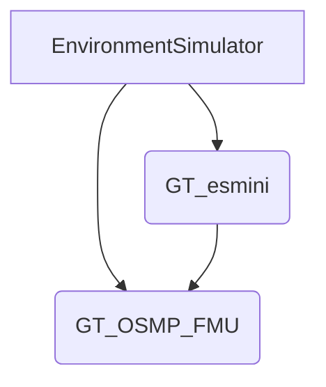

# Repository Knowledge Graph: GT_esmini

This document defines the structural context, dependencies, and operational rules for the `GT_esmini` repository.

## 1. Top-Level Structure

### **Roots**
- **Repository Root**: `e:\Repository\GT_esmini\esmini`
- **Core Engine**: `EnvironmentSimulator` (Vanilla esmini)
- **Extension Module**: `GT_esmini` (Custom Logic)
- **Naming**: "GT" = **GroundTruth** (OSI GroundTruth), not Grand Touring. GT_Sim = GroundTruth_Sim.

### **Directory Responsibilities**

| Directory | Role | AI Strategy |
| :--- | :--- | :--- |
| **`EnvironmentSimulator/`** | **Upstream Core**. Contains the vanilla esmini source code (`esminiLib`, `RoadManager`, `Applications`). | **READ-ONLY (Strict)**. Treat as an external dependency. Do not modify unless absolutely necessary for linking/binding. |
| **`GT_esmini/`** | **Extension Scope**. Contains all custom logic (`RealVehicle`, `AutoLight`, `OSIReporter`). | **ACTIVE Development**. All new features, logic changes, and fixes must reside here. |
| **`GT_OSMP_FMU/`** | **Integration Wrapper**. Wrapper to build `GT_esmini` as a Functional Mock-up Unit (FMU). | **Build Target**. Depends on `GT_esmini` libraries. |
| **`OSMP_FMU/`** | **Reference Wrapper**. Vanilla esmini FMU wrapper. | **Reference**. Use for comparison/debugging only. |
| **`resources/`** | **Assets**. `xodr` (OpenDRIVE), `xosc` (OpenSCENARIO), Models. | **Input Data**. If simulation fails, assume Code Bug > Asset Bug. |
| **`scripts/`** | **Utilities**. Python scripts, tools. | **Support**. |

## 2. Operational Rules (Directives)

### **R1: Clean Core Policy**
- **Constraint**: `EnvironmentSimulator` and `OSMP_FMU` MUST remain pristine.
- **Action**: Reject requests to modify core files to support new features. Implement wrappers or hooks in `GT_esmini` instead.

### **R2: Extension First Policy**
- **Constraint**: innovative logic resides in `GT_esmini`.
- **Action**: When implementing a feature (e.g., new sensor, control logic), create new files in `GT_esmini/` or modify existing `GT_*` files.

### **R3: Implementation Validation Bias**
- **Constraint**: `resources` assets are trusted.
- **Action**: On simulation error (crash, unexpected behavior), prioritize debugging `GT_esmini` C++ code over modifying `xosc`/`xodr` files.

## 3. Build System & Dependency Graph

### **Build Context**
- **System**: CMake
- **Toolchain**: Visual Studio 2022 (Windows), GCC/Clang (Linux)

### **Dependency Graph**

```mermaid
graph TD
    A[EnvironmentSimulator] --> B(GT_esmini)
    A --> C(GT_OSMP_FMU)
    B --> C
```
*Note: `GT_esmini` is built as a subdirectory of the root project, effectively extending `EnvironmentSimulator` but physically separated.*

### **Build Protocols**

#### **Protocol A: Main Project (Core + Extension)**
- **Scope**: `esmini`, `GT_Sim`, `GT_esminiLib`
- **Root**: Repository Root (`.`)
- **Command**:
  ```powershell
  cmake -S . -B build -G "Visual Studio 17 2022" -A x64
  cmake --build build --config Release
  ```
- **Output**: `build/GT_esmini/Release/GT_esminiLib.dll`
- **Note**: `esmini_fmu` is excluded from ALL_BUILD (`add_subdirectory(GT_OSMP_FMU EXCLUDE_FROM_ALL)`) — see Protocol B status.
- **Embedded Python**: `GT_ENABLE_EMBEDDED_PYTHON` is a real option, **default OFF** (audit SUB-1) — dev builds need no Python3 dev headers and PythonDriverController is excluded. Distribution keeps the frozen stack: `build_package.ps1` configures with `-DGT_ENABLE_EMBEDDED_PYTHON=ON`.

#### **Protocol B: FMU Export (Integration) — KNOWN BROKEN**
- **Status**: `GT_OSMP_FMU/CMakeLists.txt` hand-copies a GT source list that has drifted from `GT_esmini/CMakeLists.txt`; the `esmini_fmu` target cannot link (audit BLD-1/SUB-3). Repair plan: link `GT_esminiLib_static` instead of re-listing sources, then re-enable in ALL_BUILD.
- **Scope**: `esmini.fmu` (with GT extensions)
- **Build (once repaired)**: `cmake --build build --config Release --target esmini_fmu` from the repository root (the standalone `GT_OSMP_FMU/build` flow is superseded by the in-tree `add_subdirectory`).

## 4. Python Environment

> **Development Freeze**: Python-related features (PythonDriverController, Embedded Python, DriverScript) are frozen as of v0.8. Existing functionality remains available but no new features are planned.

- **Runtime**: `DriverScript/.venv` (Python 3.12)
- **Dependencies**: `DriverScript/requirements.txt`; scenario-authoring tooling pins live in `resources/scenario_authoring/requirements-authoring.txt` (build-time only, dev-freeze does not apply)
- **Web backend**: `GT_esmini/web/` (FastAPI + SQLite). Decoupled from DriverScript at import time (audit WEB-6/SCR-7): `absolutize_scenario_paths` is vendored in `backend/services/xosc_paths.py`, the `EsminiRMLib` ctypes wrapper lives in `GT_esmini/scripts/rm_lib.py` (DriverScript keeps a shim), and PythonDriver tooling is lazy-imported. The server starts without DriverScript present.
- **Electron desktop**: `GT_esmini/web/electron/` (Electron wrapper for Web UI)
- **C++ embedded interpreter**: opt-in via `-DGT_ENABLE_EMBEDDED_PYTHON=ON` (see Protocol A note)
- **Rule**: Never use system Python directly. Always activate or reference the venv.

## 5. Test Strategy

### GT gates (current, executable)

| Gate | Command | Scope |
| :--- | :--- | :--- |
| **Unit** | `scripts/run_gt_tests.ps1` | ctest `test_ScenarioReaderParsing` (8 unit sources: ScenarioReader, RealDriver utils, LonProfilePlanner, VD PIDPurePursuit / AutoIndicator / TrafficPolicies). Green; runs in CI. |
| **Pre-merge regression** | `scripts/run_regression_gate.ps1` | Step 1 = unit gate (hard). Step 1.5 = ODR conformance quick (hard, `-SkipOdr` to skip). Step 2 = VirtualDriver behavioral batch (`gt_sim_test.py batch resources/xosc/verification/phase3_batch.yaml`, in-process via `GT_esminiLib.dll`, venv `DriverScript/.venv`). Behavioral fails WARN by default; `-FailOnBehavioral` gates. Requires a completed Release build. |
| **ODR conformance** | `scripts/run_odr_conformance.py` (venv `DriverScript/.venv`) | OpenDRIVE 1.6-1.9 baseline (plan P0). `--profile quick` (schema + esminiRMLib RM probe layers) = regression-gate Step 1.5. `--profile full` adds the OSI layer; run manually with goldens + `--smoke` after parser changes. Official ASAM fixtures are local-only (auto-SKIP without the thirdparty zips); CI (`ci.yml` `test-no-external-modules`, ubuntu/Release) runs the schema layer only via `--layers schema --check-matrix` (RM/OSI stay local — cross-OS golden risk). See `GT_esmini/test/odr_fixtures/README.md`. |

| **Scenario catalog (F1)** | `DriverScript/.venv/Scripts/python.exe resources/scenario_authoring/validate_catalog.py` | Generated road/scenario catalog: esmini headless EXIT==0 road probes + gt_sim_test in-process runs (VD telemetry frames>0). Batch manifest: `gt_sim_test.py batch resources/scenario_authoring/scenario_templates/generated/catalog_batch.yaml --out test_results/web/<batch_id>` → runs auto-register in the annotation UI. See `resources/scenario_authoring/README.md`. |

- **Build pass** (Protocol A) remains the primary gate; **smoke run** (`GT_Sim.exe` on representative xosc/xodr) for viewer/OSI sanity.
- **CI** (`.github/workflows/ci.yml` test job) runs the GT unit ctest step after upstream `run_tests.sh` (audit TST-1 closed).
- **Integration (opt-in, green)**: `GT_esmini_Integration_*` GT_Loader tests were re-authored 2026-07 (audit R3/TST closed): 21 tests — 6 AutoLight/LightStateAction (incl. 2 graceful-degradation negatives) + 15 ControllerRealDriver — registered explicitly with per-test assertions (init rc==0, entity presence, run completion, light-state changes / movement; audit TST-3 closed). Run via `run_gt_tests.ps1 -IncludeIntegration`; kept out of the default gate for runtime only. The 17 frozen `pythondriver_*` scenarios register only with `GT_ENABLE_EMBEDDED_PYTHON=ON` (audit MSC-5 closed) and are not part of any green gate.
- **Focus areas**: ManualDrive / KinematicController / LHT junction behavior (recent hotspots).

### Legacy (frozen)
The PythonDriver comparison/verification toolchain (compare_python_vs_default, comparison_kpis, plot_comparison, validate_realdriver_feature_results, run_comparison_test, comparison_matrix.yaml) has been moved to `archive/frozen_python_verification/` (audit SCR-2). Not maintained; imports are stale. `GT_esmini/test/comparison_thresholds.yaml` was NOT moved — it is actively read/written by the web backend (`config.py` `load_thresholds`/`save_thresholds`).

## 6. Package Build (EXE Distribution)

Use `/package --version <VERSION>` skill for automated build. See `.claude/skills/package/SKILL.md` for details; the pipeline's single source of truth is `scripts/build_package.ps1`.

- **Prerequisites**: C++ build complete (`GT_Sim.exe`), embedded Python in `thirdparty/python-embed/`
- **Pipeline**: Frontend build → PyInstaller → ZIP archive
- **Output**: `dist/GT_Sim_v<VERSION>.zip` → Launch via `GT_Sim.bat` → `http://127.0.0.1:8000`

## 7. Git Workflow

- **Branches**: `master` (stable) → `dev_v0.<N>` (development integration) → `feature/*` (feature work)
- **Commits**: Conventional Commits (`feat:`, `fix:`, `chore:`, `refactor:`, `docs:`)
- **PR flow**: `feature/*` → `dev_v0.<N>` → `master`
- **GitHub CLI**: `gh` can resolve the upstream parent (`esmini/esmini`). `gh repo set-default GT-karny/esmini` is set in this clone (re-run it in fresh clones); write operations must still pass `-R GT-karny/esmini` (enforced by the guard hook).

## 8. Claude Code Harness

- **Settings**: `.claude/settings.json` (committed) — permission allowlist for build/test commands + PreToolUse guard-hook registration.
- **Guard hook** (`.claude/hooks/gt_guard.ps1`) enforces deterministically:
  1. **R1 Clean Core** — edits under `EnvironmentSimulator/` or `OSMP_FMU/` require explicit user approval (fork-budget discipline).
  2. **venv policy** — bare `python`/`pip`/`py` commands are denied with a pointer to the project venvs (§4).
  3. **gh repo safety** — `gh pr/release/issue` write operations without `-R`/`--repo` are denied.
- **Project skills**: `/build` (Protocol A build + DLL staging + detached long-build pattern), `/gates` (test-gate ladder of §5 + result interpretation), `/package` (distribution ZIP), `/release` (release procedure with approval checkpoints). When asked to verify changes, run `/gates`.

## 9. Contextual Links

- **`GT_esmini` Internals**: See [`GT_esmini/CLAUDE.md`](file:///e:/Repository/GT_esmini/esmini/GT_esmini/CLAUDE.md)
- **`scripts/` Guide**: See [`scripts/CLAUDE.md`](file:///e:/Repository/GT_esmini/esmini/scripts/CLAUDE.md)
- **`DriverScript/` Guide**: See [`DriverScript/CLAUDE.md`](file:///e:/Repository/GT_esmini/esmini/DriverScript/CLAUDE.md)
