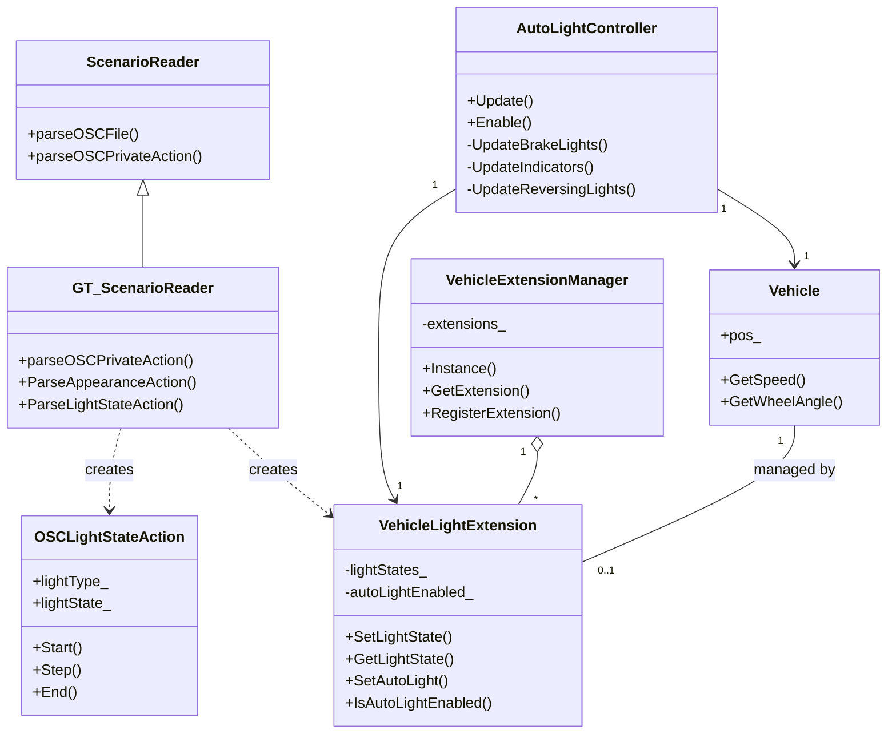
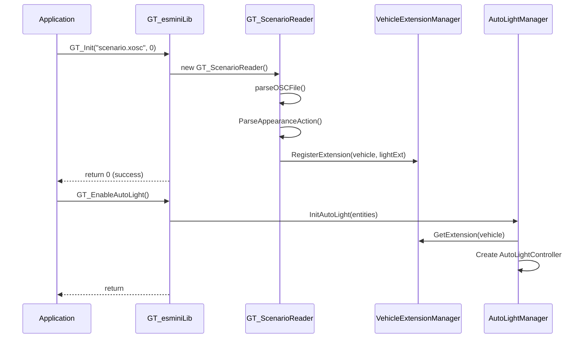
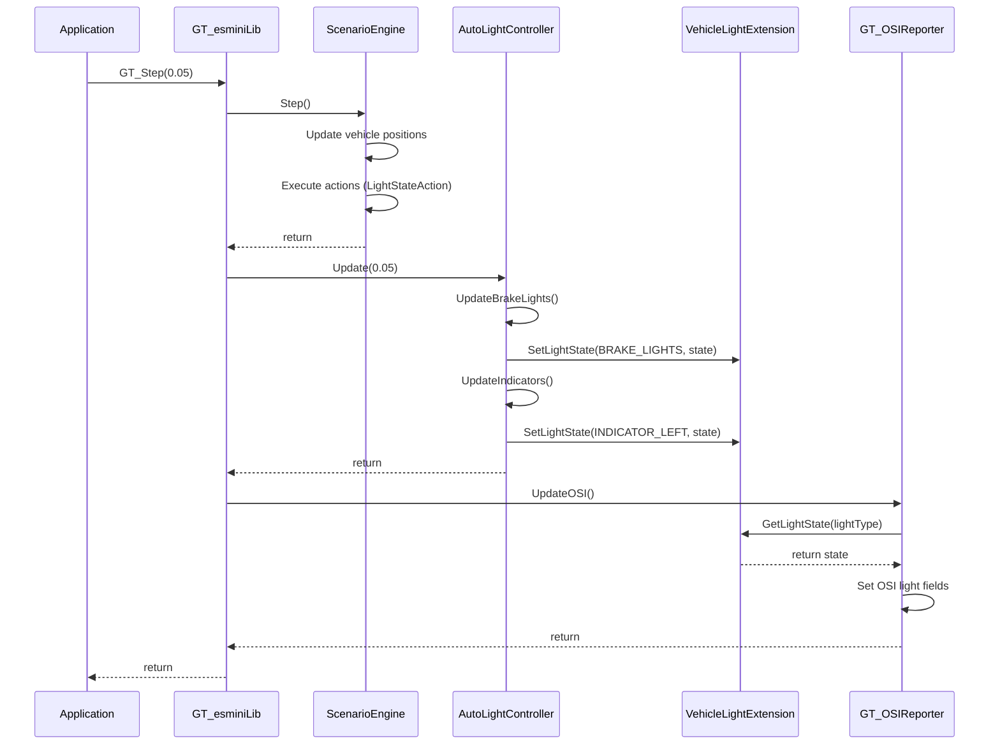

# アーキテクチャ

このドキュメントでは、GT_esminiの設計思想と内部構造について説明します。

## 設計思想

GT_esminiは、以下の設計原則に基づいて実装されています：

### 1. 非侵襲的な拡張

**原則:** esmini本体のファイルを一切変更しない

**実装方法:**
- **継承パターン**: `ScenarioReader`を継承した`GT_ScenarioReader`を作成
- **コンポジションパターン**: `Vehicle`クラスを継承せず、`VehicleLightExtension`で拡張
- **ビルド時の置換**: `OSIReporter.cpp`を`GT_OSIReporter.cpp`で置換

**メリット:**
- esmini本体のアップデート時、マージ作業が不要
- GT_esmini独自コードが完全に分離
- 将来的なesmini本体へのコントリビューションが容易

### 2. 最小限の依存関係

**原則:** esmini本体への変更を最小限に抑える

**実装方法:**
- ルート`CMakeLists.txt`への変更: `add_subdirectory(GT_esmini)`の1行のみ
- `ScenarioEngine/CMakeLists.txt`への変更: `OSIReporter.cpp`の置換のみ

### 3. モジュール性

**原則:** 各機能を独立したモジュールとして実装

**実装方法:**
- `ExtraAction`: ライトアクション定義
- `ExtraEntities`: 車両拡張機能
- `GT_ScenarioReader`: シナリオパース拡張
- `AutoLightController`: 自動ライト制御
- `GT_OSIReporter`: OSI出力拡張

## 主要コンポーネント

### GT_ScenarioReader

**役割:** OpenSCENARIOシナリオのパース処理を拡張

**継承関係:**
```
scenarioengine::ScenarioReader
    ↑
    |
gt_esmini::GT_ScenarioReader
```

**主な機能:**
- `AppearanceAction`のパース
- `LightStateAction`のパース
- `VehicleLightExtension`の登録

**実装ファイル:**
- `GT_ScenarioReader.hpp`
- `GT_ScenarioReader.cpp`

### VehicleLightExtension

**役割:** 車両にライト状態を保持する機能を追加

**設計パターン:** コンポジションパターン

**理由:** `Vehicle`クラスを継承すると、esmini本体のアップデート時に影響を受けやすいため

**主な機能:**
- ライト状態の保持（`std::map<VehicleLightType, LightState>`）
- ライト状態の設定・取得
- AutoLight有効フラグの管理

**実装ファイル:**
- `ExtraEntities.hpp`
- `ExtraEntities.cpp`

### VehicleExtensionManager

**役割:** `Vehicle`オブジェクトと`VehicleLightExtension`を関連付ける

**設計パターン:** シングルトンパターン

**主な機能:**
- `Vehicle`ポインタをキーとした拡張の管理
- 拡張の登録・取得
- リソースの自動管理（`std::unique_ptr`）

**実装ファイル:**
- `ExtraEntities.hpp`
- `ExtraEntities.cpp`

### AutoLightController

**役割:** 車両の動作に応じて自動的にライトを制御

**主な機能:**
- ブレーキランプの制御（減速度ベース）
- ウインカーの制御（車線変更・右左折検出）
- バックライトの制御（速度ベース）

**更新タイミング:** `GT_Step`内で毎フレーム呼び出される

**実装ファイル:**
- `AutoLightController.hpp`
- `AutoLightController.cpp`

### GT_OSIReporter

**役割:** OSI出力にライト状態を追加

**実装方法:** esmini本体の`OSIReporter.cpp`をコピーして拡張

**主な変更点:**
- `UpdateOSIMovingObject`関数にライト状態の出力処理を追加
- `VehicleExtensionManager`を使用してライト状態を取得
- **[New]** デュアル軌道ロジックの実装:
    - Ghostオブジェクトの`trail_`から`future_trajectory`をサンプリング
    - Egoオブジェクト用にGhostへのリカバリスプラインを生成・出力

**実装ファイル:**
- `GT_OSIReporter.cpp`

### GT_esminiLib

**役割:** GT_esmini機能を提供するC言語API

**主な機能:**
- `GT_Init`: GT_ScenarioReaderを使用した初期化
- `GT_Step`: シミュレーションステップの実行
- `GT_EnableAutoLight`: AutoLight機能の有効化
- `GT_GetLightState`: ライト状態の取得
- `GT_Close`: クリーンアップ

**実装ファイル:**
- `GT_esminiLib.hpp`
- `GT_esminiLib.cpp`

## クラス図



## シーケンス図

### 初期化シーケンス



### シミュレーションステップシーケンス



## データフロー

### ライト状態の設定フロー

```
LightStateAction (XOSC)
    ↓
GT_ScenarioReader::ParseLightStateAction()
    ↓
OSCLightStateAction::Start()
    ↓
VehicleLightExtension::SetLightState()
    ↓
lightStates_[lightType] = state
```

### AutoLightの更新フロー

```
GT_Step()
    ↓
AutoLightController::Update()
    ↓
UpdateBrakeLights() / UpdateIndicators() / UpdateReversingLights()
    ↓
VehicleLightExtension::SetLightState()
    ↓
lightStates_[lightType] = state
```

### OSI出力フロー

```
GT_Step()
    ↓
GT_OSIReporter::UpdateOSI()
    ↓
VehicleExtensionManager::GetExtension(vehicle)
    ↓
VehicleLightExtension::GetLightState(lightType)
    ↓
OSI MovingObject.VehicleClassification.LightState
```

## ファイル構成

```
GT_esmini/
├── ExtraAction.hpp          # ライトアクション拡張定義
├── ExtraAction.cpp          # ライトアクション実装
├── ExtraEntities.hpp        # Vehicleクラス拡張定義
├── ExtraEntities.cpp        # Vehicleクラス拡張実装
├── GT_ScenarioReader.hpp    # ScenarioReader継承クラス
├── GT_ScenarioReader.cpp    # AppearanceActionパース実装
├── AutoLightController.hpp  # AutoLight機能
├── AutoLightController.cpp
├── GT_esminiLib.hpp         # GT_esmini用ラッパーAPI
├── GT_esminiLib.cpp         # 起動時引数処理等
├── GT_OSIReporter.cpp       # OSI出力拡張
├── CMakeLists.txt           # ビルド設定
├── README.md                # プロジェクト概要
├── docs/                    # ドキュメント
└── test/                    # テストディレクトリ
    ├── unit/                # ユニットテスト
    ├── integration/         # 統合テスト
    └── scenarios/           # テストシナリオ
```

## 拡張性

GT_esminiは、以下の点で拡張可能です：

### 新しいライトタイプの追加

1. `VehicleLightType`列挙型に新しいタイプを追加
2. `GT_ScenarioReader::ParseLightStateAction`にパース処理を追加
3. `GT_OSIReporter`にOSI出力処理を追加（必要に応じて）

### 新しいAutoLight機能の追加

1. `AutoLightController`に新しい`Update*`メソッドを追加
2. `AutoLightController::Update`から呼び出し

### 新しいAppearanceActionの追加

1. `ExtraAction.hpp`に新しいアクションクラスを定義
2. `GT_ScenarioReader::ParseAppearanceAction`にパース処理を追加

## パフォーマンス考慮事項

### メモリ使用量

- `VehicleLightExtension`: 車両1台あたり約200バイト
- `AutoLightController`: 車両1台あたり約100バイト

### CPU使用量

- `AutoLightController::Update`: 車両1台あたり約0.01ms（通常のPC）
- `GT_OSIReporter`: OSI出力が有効な場合、追加で約0.1ms

## 次のステップ

- [基本的な使い方](03_basic_usage.md) - GT_esminiの基本
- [APIリファレンス](10_api_reference.md) - 関数の詳細仕様

## 関連ドキュメント

- [概要](01_overview.md) - GT_esminiの全体像
- [LightStateAction機能](04_light_state_action.md) - ライト制御の詳細
- [AutoLight機能](05_auto_light.md) - 自動制御の詳細
