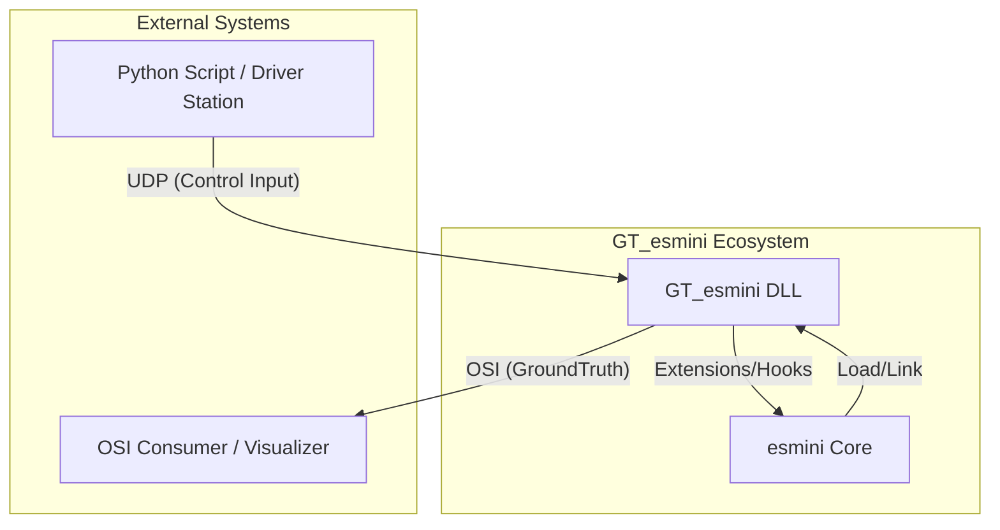
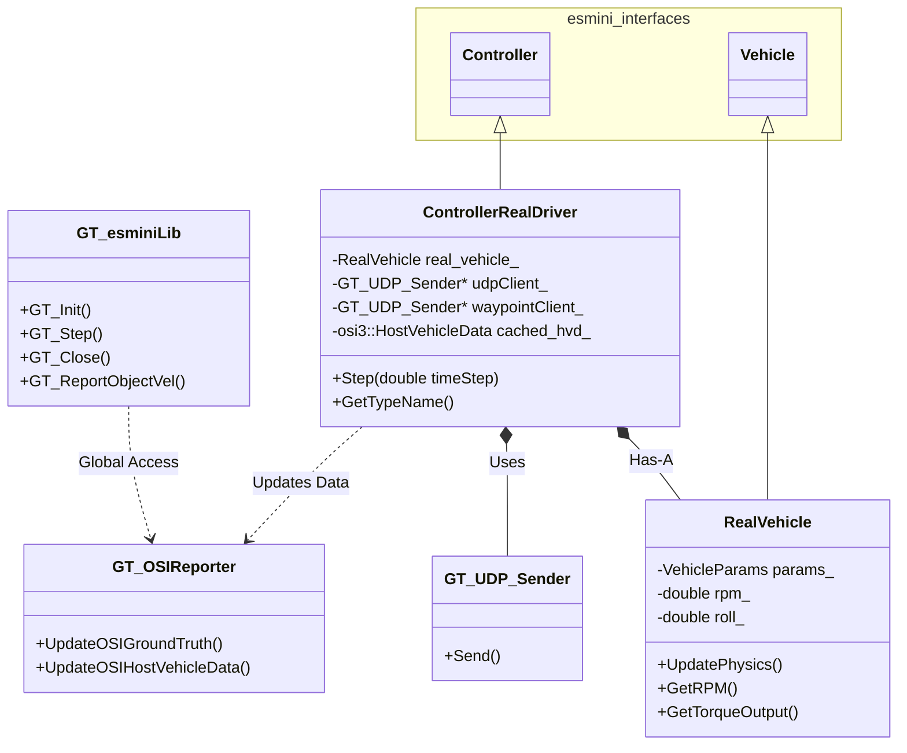
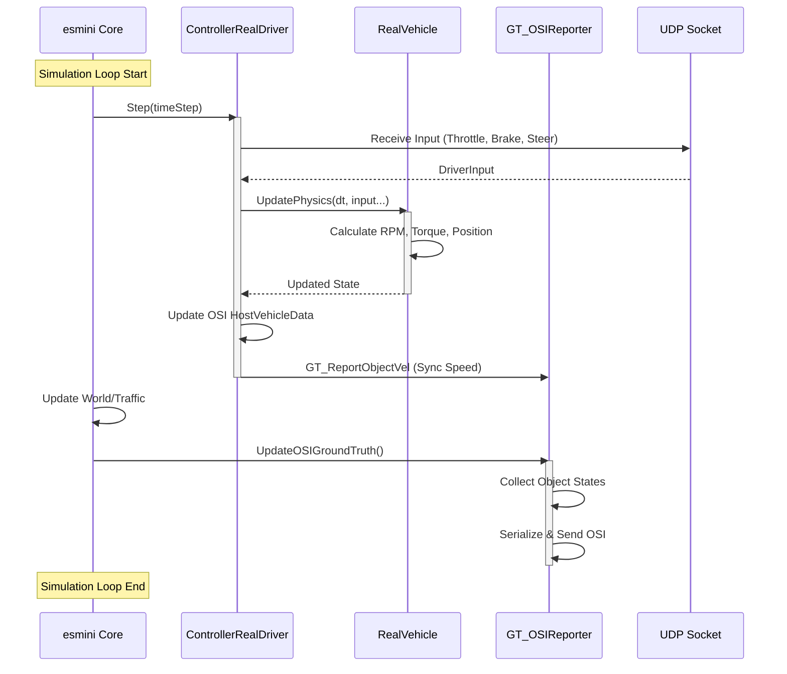
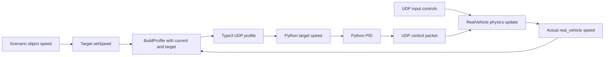

# System Structure

GT_esminiの内部構造とデータフローを可視化します。

## Refactor Notes (2026)

- ソース配置は `src/{core,scenario,io,control,osi}` に統一。
- ヘッダは `include/gt_esmini/...` 配下に統一。
- HostVehicleDataは `osi` モジュール責務として管理。
- 設定ファイルは `GT_esmini/config/` へ移動。

## 1. System Context Diagram (システム概要)

GT_esminiは`esmini`を拡張し、外部コントローラ(RealDriver)やOSI出力機能を提供します。

## 2. Class Diagram (クラス構成)

主要なクラスとそれらの関係性を示します。

## 3. Sequence Diagram (処理フロー)

1フレームあたりの処理フロー（`GT_Step` および内部の `Controller` 処理）を示します。

## 4. Longitudinal Data Domains (Target vs Actual)

RealDriverの縦制御には、速度の値系が2つあります。

- Target値系 (`setSpeed_`):
  - 目標速度。シナリオ/オブジェクト速度を起点に更新される。
  - `LonProfilePlanner` に入力され、type=3プロファイルとしてPythonへ送信される。
- Actual値系 (`real_vehicle_.speed_`):
  - UDP入力（throttle/brake/gear）と車両物理で更新される実運動速度。
  - `UpdateVehiclePhysics()` で更新される。

### Synchronization Gate

`SyncGatewayObjectState(..., blockSpeedUpdate)` により、`real_vehicle_.speed_` を `object` 側へ反映するかを切り替える。

- `blockSpeedUpdate=false`: `object` へ実速度を同期
- `blockSpeedUpdate=true`: 同期しない（値系が一時的に乖離し得る）

このゲートは、実行中の縦アクション状態（`hasRunningScenarioLongAction`）で決まる。

そのため、設計上は「target値系」と「actual値系」が常に同一とは限らない。
