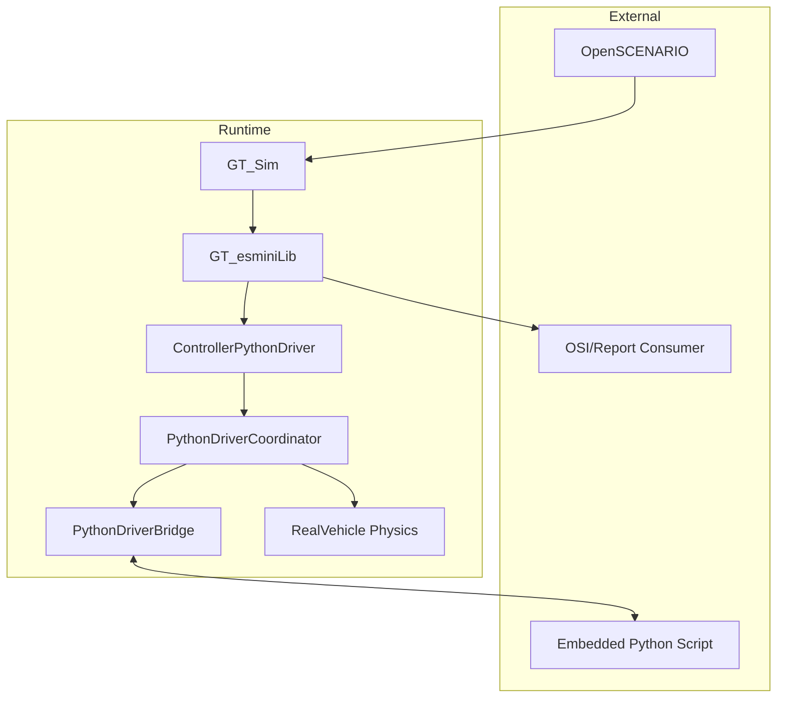
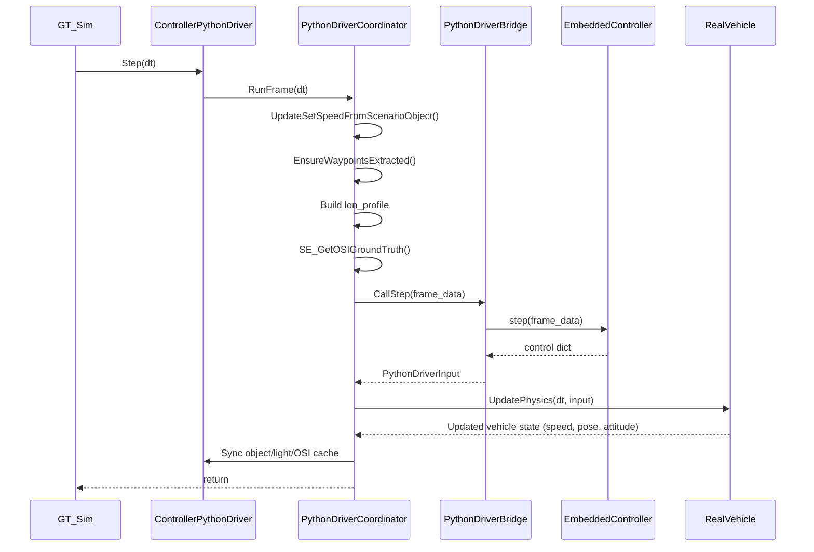

# System Structure

GT_esmini の現行アーキテクチャ（2026-02時点）をまとめます。

## 1. Overview

- 実行基盤: `esmini` + `GT_esminiLib`
- 主要実行バイナリ:
  - `GT_Sim`（検証・可視化・動画取得）
  - `GT_esminiLib`（controller登録、GT API、OSI連携）
- 推奨コントローラ:
  - `PythonDriverController`（Embedded Python, 同期実行）
- 互換コントローラ:
  - `RealDriverController`（UDP 外部Python、非推奨・互換用途）
- ビルドポリシー:
  - `PythonDriverController` 対応は必須（`GT_ENABLE_EMBEDDED_PYTHON` オプションは廃止）

## 2. Module Layout

- `GT_esmini/src/core`
  - `GT_esminiLib.cpp`  
    GT API (`GT_InitWithArgs`, `GT_Step`, `GT_Close`) / controller registration
- `GT_esmini/src/control`
  - `ControllerPythonDriver.cpp`  
    Embedded controller本体
  - `ControllerRealDriver.cpp`  
    互換用UDP controller
- `GT_esmini/src/control/pythondriver`
  - `PythonDriverBridge.cpp`  
    C++↔Python変換/呼び出し/例外処理
  - `PythonDriverCoordinator.cpp`  
    1フレーム処理順序のオーケストレーション
- `DriverScript/pythondriver`
  - `scenario_drive_embedded.py`  
    Python側の `EmbeddedController`
- `scripts`
  - `run_realdriver_feature_tests.ps1`（名称は互換だが既定は pythondriver matrix）
  - `validate_realdriver_feature_results.py`
  - `render_realdriver_report.py`

## 3. Runtime Context

## 4. Controller Architecture

### 4.1 PythonDriverController（推奨）

- 基本方針: 1 simulation frame = 1 Python `step()`
- 主要入力（C++→Python）:
  - `ground_truth_bytes` (OSI protobuf bytes)
  - `waypoints`
  - `lon_profile`
  - `set_speed`, `current_speed`, `dt`, `frame_id`
- 主要出力（Python→C++）:
  - `throttle`, `brake`, `steering`, `gear`, `light_mask`
  - `engine_brake`, `adas_states`（任意）

### 4.2 RealDriverController（互換）

- UDPによる外部プロセス連携
- 非同期性により再現性評価が難しいため、新規検証は `PythonDriverController` を前提とする

## 5. Frame Sequence (PythonDriver)

注記:
- `RealVehicle` の結果は `ControllerPythonDriver::SyncGatewayObjectState()` 経由で `object_/gateway_` に反映される。
- その後 `Controller::Step()` に戻るため、`GT_Sim` が見る車両状態は RealVehicle 物理更新後の値になる。

## 6. GT_Sim Execution Model

- `--hz N`: 固定ステップ幅 `dt = 1/N`
- `--no_realtime`: wall-clock pacing（sleep）を無効化し、可能な限り高速実行
- `--video_capture` 系オプション: TGAキャプチャ（動画は後段 ffmpeg 変換）

> `--hz` は積分刻み幅設定であり、リアルタイム拘束のON/OFFは `--no_realtime` で制御する。

## 7. Validation Architecture

- matrix: `GT_esmini/test/validation/pythondriver_feature_matrix.yaml`
- thresholds: `GT_esmini/test/validation/kpi_thresholds.yaml`
- runner: `scripts/run_realdriver_feature_tests.ps1`
- validator: `scripts/validate_realdriver_feature_results.py`
- report: `scripts/render_realdriver_report.py`

### F01 Direct Evidence Mode

F01はログだけでなく、C++↔Python の直接証跡を必須化。

生成トレース（F01）:
- `cpp_to_py_trace.jsonl`
- `py_to_cpp_trace.jsonl`
- `python_trace.jsonl`

判定軸（F01）:
- required log patterns
- forbidden log patterns
- trace integrity（frame連番・欠損・キー・値域）
- 最低限KPI（`duration_s`, `xy_path_length_m`）

## 8. Error Handling Policy (PythonDriver)

- `init()` 失敗: fatal error としてシナリオ停止
- `step()` 例外: fatal error としてシナリオ停止
- 無言継続しない（`failure_reasons` に明示）

## 9. Key Files

- `GT_esmini/src/core/GT_esminiLib.cpp`
- `GT_esmini/GT_Sim/main.cpp`
- `GT_esmini/src/control/ControllerPythonDriver.cpp`
- `GT_esmini/src/control/pythondriver/PythonDriverBridge.cpp`
- `GT_esmini/src/control/pythondriver/PythonDriverCoordinator.cpp`
- `DriverScript/pythondriver/scenario_drive_embedded.py`
- `scripts/run_realdriver_feature_tests.ps1`
- `scripts/validate_realdriver_feature_results.py`
- `scripts/render_realdriver_report.py`

## 10. Build Guardrails

- `GT_ENABLE_EMBEDDED_PYTHON` オプションは提供しない（指定した configure はエラー終了する）。
- `GT_Sim` 起動時に `GT_Sim build: PythonDriverController=ENABLED` を出力し、対応ビルドを判別できる。
