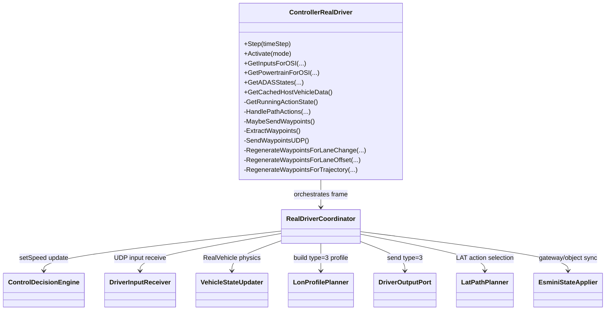
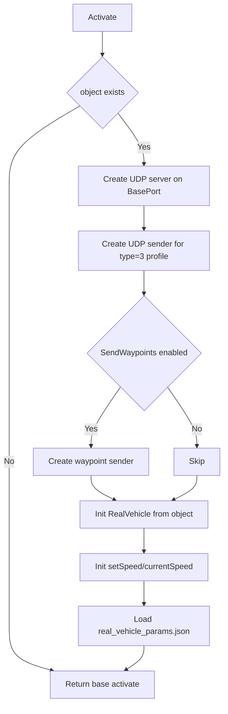
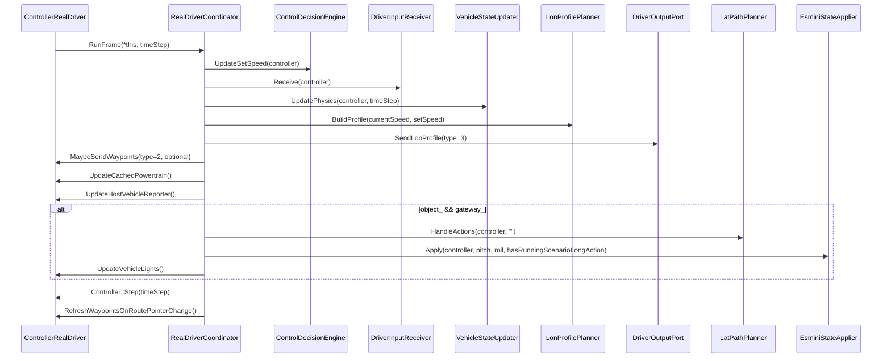
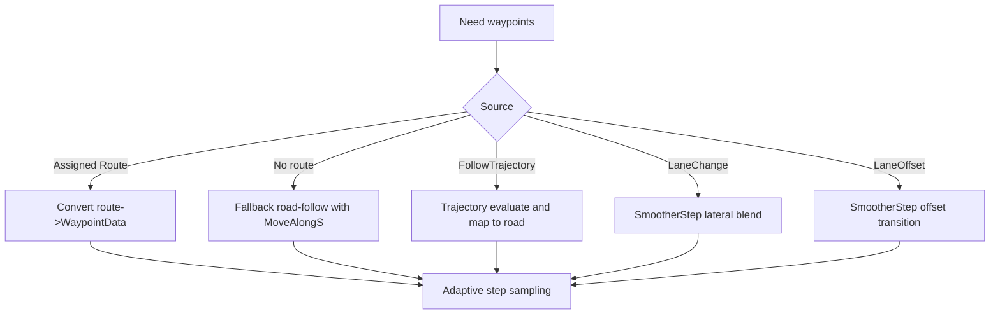
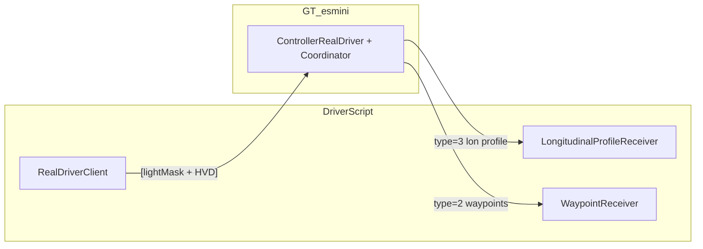

# ControllerRealDriver Logic (Current)

Target files:
- `GT_esmini/include/gt_esmini/control/ControllerRealDriver.hpp`
- `GT_esmini/src/control/ControllerRealDriver.cpp`
- `GT_esmini/src/control/realdriver/*.cpp`

## 1. Component Structure

## 2. Activation Flow

Notes:
- Base input port default: `53995`
- Longitudinal output port default: `54995`
- Waypoint output port default: `54996`
- Current implementation uses fixed base port behavior (no `object_id` port offset).

## 3. Per-frame Flow (`Step`)

## 4. LAT Action Selection

`LatPathPlanner::HandleActions` performs domain-first selection:

1. Collect currently RUNNING LAT actions:
   - `FollowTrajectory`
   - `LaneChange`
   - `LaneOffset`
   - `AssignRoute`
2. Select exactly one action by newest action id (`GetId()` max).
3. Build one-action state and call `ControllerRealDriver::HandlePathActions`.

Important:
- Legacy hard-coded priority (`FollowTrajectory > LaneChange > LaneOffset > AssignRoute`) is not used in the selector.
- Effective behavior is "newest started action wins" (id-based).

## 5. LaneOffset Transition Distance

`ControllerRealDriver::HandlePathActions` computes lane offset transition distance as:

- `DISTANCE`: `max(paramValue, 5.0)`
- `TIME`: `max(objectSpeed, 5.0) * max(paramValue, 0.1)`
- `RATE`: `max(objectSpeed, 5.0) * (deltaOffset / max(paramValue, 0.1))`

where:
- `deltaOffset = abs(targetOffset - currentOffset)`
- `objectSpeed` is current object speed.

## 6. Waypoint Generation / Sampling

Adaptive step rule:
- Base: `5m`
- Action path base (`FollowTrajectory` / `LaneChange` / `LaneOffset`): `2m`
- If heading delta `> 3 deg`: `2m`
- If heading delta `> 8 deg`: `1m`

## 7. UDP Packet Formats

### 7.1 Input (Python -> C++)
- `[int32 lightMask][HostVehicleData protobuf bytes]`

### 7.2 Output Waypoint (C++ -> Python)
- `type=2`
- Header: `[u8 type][u32 currentIndex][u32 count]`
- Body: waypoint array (`WaypointData` binary layout)
- Current Python parser expects `56 bytes / waypoint` (`<dddI4xdi4xd`)

### 7.3 Output Longitudinal Profile (C++ -> Python)
- `type=3`
- Header: `[u8 type][u32 count]`
- Point: `(double t_offset, double v_target, double a_max, double j_max)`
- Current planner default: horizon `3.0s`, `20` points, `0.15s` spacing
- Sent every frame

Removed:
- `type=1` (single target speed) is not used.

## 8. DriverScript Integration

- Input sender: `DriverScript/realdriver/client.py` (`RealDriverClient`)
- Type=3 receiver: `DriverScript/realdriver/udp_receivers.py` (`LongitudinalProfileReceiver`)
- Type=2 receiver: `DriverScript/realdriver/udp_receivers.py` (`WaypointReceiver`)
- Profile parse/interpolation: `DriverScript/realdriver/protocol/lon_profile.py`

## 9. Notes

- `ControllerRealDriver` still owns many helper methods, but frame orchestration moved to `RealDriverCoordinator`.
- `LonProfilePlanner` currently performs linear interpolation from current speed to set speed with fixed accel/jerk limits.
- `LatPathPlanner` is responsible only for action selection; detailed waypoint regeneration remains in `ControllerRealDriver`.
