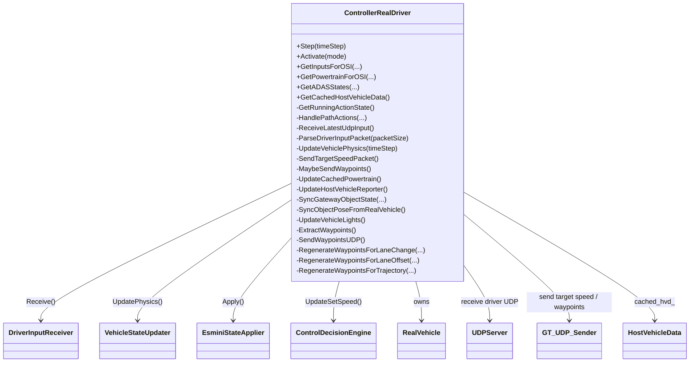
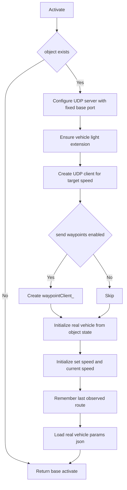
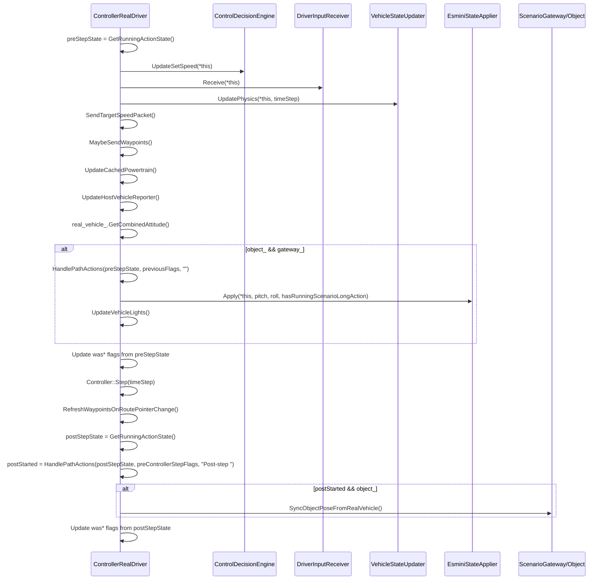
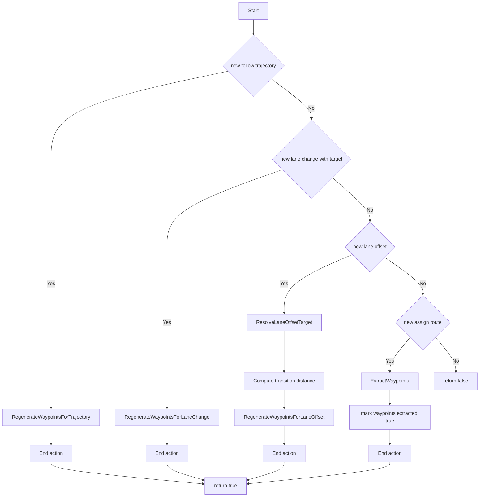
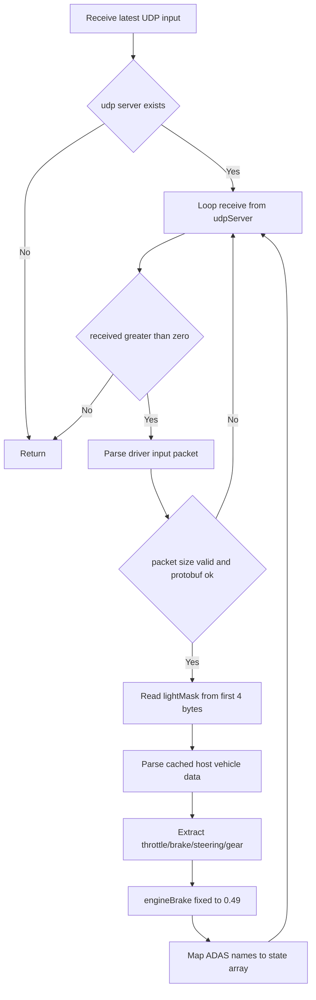
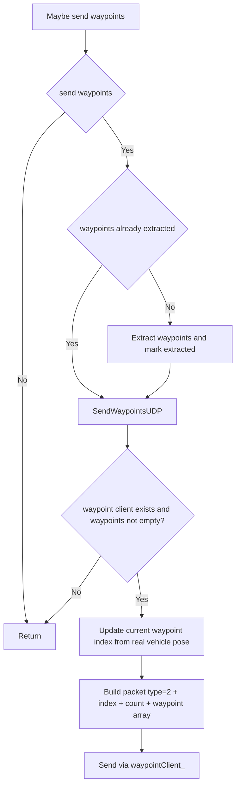
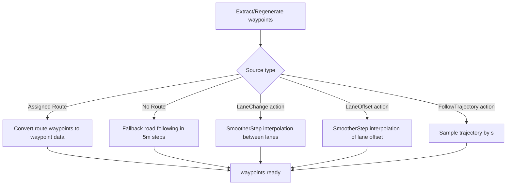
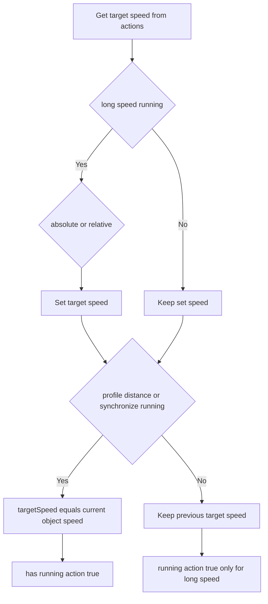
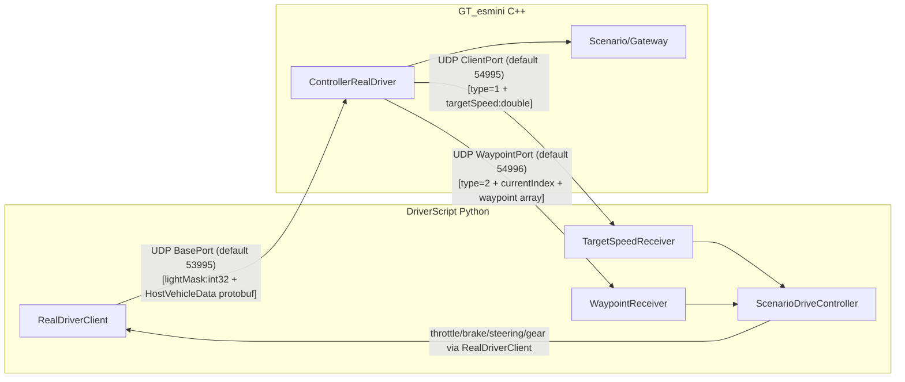
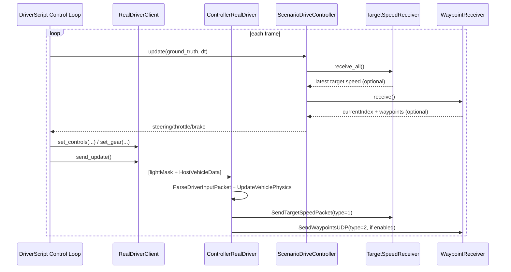

# ControllerRealDriver Logic (Mermaid)

Target files:
- `GT_esmini/include/gt_esmini/control/ControllerRealDriver.hpp`
- `GT_esmini/src/control/ControllerRealDriver.cpp`

## 1. Component Structure

## 2. Activation Flow

## 3. Main Step Loop

## 4. Path Action Priority (`HandlePathActions`)

## 5. UDP Receive/Parse Pipeline

## 6. Waypoint Send/Generation Logic

## 7. Longitudinal Action Handling Summary

## 8. DriverScript Integration

`ControllerRealDriver` と DriverScript は、UDPで双方向に接続されます。

- C++受信: `DriverScript/realdriver/client.py` (`RealDriverClient.send_update`)
- C++送信(目標速度): `DriverScript/realdriver/udp_receivers.py` (`TargetSpeedReceiver`)
- C++送信(ウェイポイント): `DriverScript/realdriver/udp_receivers.py` (`WaypointReceiver`)
- Python統合制御: `DriverScript/realdriver/scenario_drive.py` (`ScenarioDriveController`)

## 9. End-to-End Runtime Loop (with DriverScript)

## 10. Packet Compatibility Notes

- RealDriver input packet (Python -> C++):
  - `int32 lightMask` + `HostVehicleData protobuf bytes`
  - 実装: `DriverScript/realdriver/client.py`, `GT_esmini/src/control/ControllerRealDriver.cpp`
- TargetSpeed packet (C++ -> Python):
  - `uint8 type=1` + `double targetSpeed` (9 bytes)
  - 実装: `GT_esmini/src/control/ControllerRealDriver.cpp`, `DriverScript/realdriver/udp_receivers.py`
- Waypoint packet (C++ -> Python):
  - `uint8 type=2` + `uint32 currentIndex` + `uint32 count` + waypoint struct配列
  - Python側は `DriverScript/realdriver/waypoint.py` で C++構造体アライメントを考慮して `56 bytes/waypoint` として解析

注意:
- 現在の `ControllerRealDriver` は固定ポート運用（`BasePort` をそのまま使用）で、`object_id` 加算はしていません。
