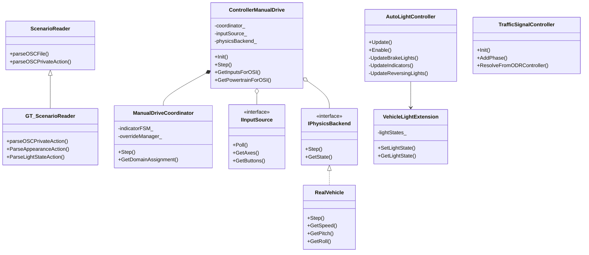

# アーキテクチャ

このドキュメントでは、GT_esminiの設計思想と内部構造について説明します。

## 設計思想

GT_esminiは、以下の設計原則に基づいて実装されています：

### 1. 非侵襲的な拡張

**原則:** esmini本体のファイルを一切変更しない

**実装方法:**
- **継承パターン**: `ScenarioReader`を継承した`GT_ScenarioReader`を作成
- **コンポジションパターン**: `Vehicle`クラスを継承せず、`VehicleLightExtension`で拡張
- **ビルド時の置換**: `OSIReporter.cpp`を`GT_OSIReporter.cpp`で置換

**メリット:**
- esmini本体のアップデート時、マージ作業が不要
- GT_esmini独自コードが完全に分離
- 将来的なesmini本体へのコントリビューションが容易

### 2. 最小限の依存関係

**原則:** esmini本体への変更を最小限に抑える

**実装方法:**
- ルート`CMakeLists.txt`への変更: `add_subdirectory(GT_esmini)`の1行のみ
- `ScenarioEngine/CMakeLists.txt`への変更: `OSIReporter.cpp`の置換のみ

### 3. モジュール性

**原則:** 各機能を独立したモジュールとして実装

**モジュール構成:**

| モジュール | ディレクトリ | 役割 |
|:---|:---|:---|
| `core` | `src/core/` | 公開C API、設定読み込み |
| `scenario` | `src/scenario/` | OpenSCENARIO拡張パース、TrafficSignalController |
| `io` | `src/io/` | UDP通信 |
| `control` | `src/control/` | ManualDrive制御、車両物理、地形追従、ライト制御 |
| `osi` | `src/osi/` | OSI/HostVehicleData出力 |

## 主要コンポーネント

### GT_ScenarioReader

**役割:** OpenSCENARIOシナリオのパース処理を拡張

**継承関係:**
```
scenarioengine::ScenarioReader
    ↑
gt_esmini::GT_ScenarioReader
```

**主な機能:**
- `AppearanceAction`のパース
- `LightStateAction`のパース
- `VehicleLightExtension`の登録

### ControllerManualDrive

**役割:** ハンドルコントローラー/ゲームパッドによるリアルタイム車両操作

> 旧名: `ControllerRacingWheel` (v0.8 でリネーム)

**アーキテクチャ:**
```
IInputSource (入力抽象)
  ├── SDL2WheelInput        (SDL2経由のハンドルコントローラー)
  ├── NetworkInputBridge     (ネットワーク経由の入力)
  └── StubInputSource        (テスト用スタブ)

IPhysicsBackend (物理抽象)
  ├── RealVehicleBackend     (RealVehicle物理エンジン)
  └── NetworkPhysicsBridge   (外部物理エンジン)

ManualDriveCoordinator
  ├── ドメイン制御 (横方向/縦方向の手動・シナリオ切り替え)
  ├── オーバーライド管理
  └── IndicatorFSM (ウインカー自動キャンセル)
```

**主な機能:**
- **FFB (Force Feedback)**: バネ・ダンパー・クーロン摩擦モデル（G29対応）
- **ボタンマッピング**: `manual_drive.json` で全ボタンをカスタマイズ
- **ドメイン制御**: 横方向・縦方向を独立して「手動」/「シナリオ」に割り当て
- **ウインカーFSM**: OFF → ARMED → ACTIVE 状態遷移、ステアリング復帰で自動キャンセル
- **ライト制御**: ヘッドライト・ハイビーム・フォグ・ハザードのトグル操作
- **HVD出力**: `GetInputsForOSI()`, `GetPowertrainForOSI()`, `GetADASStates()`

### RealVehicle

**役割:** 詳細な車両物理モデル

**主な機能:**
- サスペンション（バネ・ダンパー）によるピッチ・ロール計算
- パワートレイン（エンジンRPM・トルク・ギア比）による駆動力計算
- `real_vehicle_params.json` による車種別パラメータ定義

### AutoLightController

**役割:** 車両の動作に応じて自動的にライトを制御

**主な機能:**
- ブレーキランプの制御（減速度ベース、チャタリング防止付き）
- ウインカーの制御（車線変更・右左折検出）
- バックライトの制御（速度ベース）
- ManualDriveコントローラーとの統合（ボタン操作+自動キャンセル）

### VehicleLightExtension

**役割:** 車両にライト状態を保持する機能を追加

**設計パターン:** コンポジションパターン（`Vehicle`クラスを継承しない）

### TrafficSignalController

**役割:** OpenSCENARIOの信号制御拡張

**主な機能:**
- フェーズベースの信号自動サイクリング
- OpenDRIVEコントローラーリファレンスによる信号ID解決
- アクション/条件ベースのフェーズ遷移

### GT_OSIReporter

**役割:** OSI出力にライト状態・HostVehicleData・デュアル軌道を追加

**主な変更点:**
- `UpdateOSIMovingObject`にライト状態の出力処理を追加
- HostVehicleData（操作入力値、パワートレイン情報）の出力
- デュアル軌道（Ghost + Ego）の出力

### GT_esminiLib

**役割:** GT_esmini機能を提供するC言語API

**主な機能:**
- `GT_Init`: GT_ScenarioReaderを使用した初期化
- `GT_Step`: シミュレーションステップの実行
- `GT_EnableAutoLight`: AutoLight機能の有効化
- `GT_GetLightState`: ライト状態の取得
- `GT_ReportObjectVel`: 車両速度の報告
- `GT_Close`: クリーンアップ

## Web UI / Electron アーキテクチャ

### 技術スタック

| レイヤー | 技術 |
|:---|:---|
| デスクトップシェル | Electron (カスタムタイトルバー) |
| バックエンド | Python FastAPI + uvicorn |
| フロントエンド | React + TypeScript + Vite |
| CSS | Tailwind CSS |
| 状態管理 | TanStack Query |
| DB | SQLite (aiosqlite) |

### ページ構成

| ページ | 機能 |
|:---|:---|
| Projects | プロジェクト一覧・管理 |
| ProjectDetail | プロジェクト詳細・シナリオ選択・実行パネル |
| Scenarios | シナリオ一覧・検索 |
| NewSimulation | シミュレーション実行フォーム |
| Simulations | ジョブ一覧・状態確認 |
| SimulationDetail | ジョブ詳細・メトリクス・結果DL |

### 主要コンポーネント

- **ManualDrivePanel**: ボタンマッピング・FFBチューニング・ドメイン制御のGUI設定
- **HvdGaugePanel**: HostVehicleData可視化
- **OsiLivePanel**: OSIデータストリーム表示
- **LiveSceneView**: 3Dシーン表示
- **WindowControls**: Electronカスタムタイトルバーボタン

## クラス図



## ファイル構成

```
GT_esmini/
├── include/gt_esmini/
│   ├── core/                    # 公開C API、設定
│   │   ├── GT_esminiLib.hpp
│   │   └── IConfigLoader.hpp
│   ├── scenario/                # OpenSCENARIO拡張
│   │   ├── GT_ScenarioReader.hpp
│   │   ├── ExtraAction.hpp
│   │   ├── ExtraEntities.hpp
│   │   └── GT_TrafficSignalController.hpp
│   ├── io/                      # UDP I/O
│   │   └── GT_UDP.hpp
│   ├── control/                 # 制御・物理
│   │   ├── ControllerManualDrive.hpp
│   │   ├── RealVehicle.hpp
│   │   └── AutoLightController.hpp
│   └── osi/                     # OSI出力
│       ├── GT_OSIReporter.hpp
│       └── GT_HostVehicleReporter.hpp
├── src/{core,scenario,io,control,osi}/  # 実装本体
├── config/                      # 実行時設定
│   ├── real_vehicle_params.json
│   ├── host_vehicle_config.json
│   └── manual_drive.json
├── web/                         # Web UI / Electron
│   ├── backend/                 # FastAPI
│   ├── frontend/                # React + Vite
│   ├── electron/                # Electronデスクトップシェル
│   └── pyinstaller/             # パッケージング
├── docs/                        # ドキュメント
└── test/                        # テスト
```

## パフォーマンス考慮事項

### メモリ使用量

- `VehicleLightExtension`: 車両1台あたり約200バイト
- `AutoLightController`: 車両1台あたり約100バイト
- `ControllerManualDrive`: 約10KB（FFBパラメータ、ボタンマッピング含む）

### CPU使用量

- `AutoLightController::Update`: 車両1台あたり約0.01ms
- `GT_OSIReporter`: OSI出力が有効な場合、追加で約0.1ms
- `ControllerManualDrive::Step`: SDL2ポーリング含め約0.1ms

## 次のステップ

- [基本的な使い方](../getting-started/basic_usage.md) - GT_esminiの基本
- [APIリファレンス](api_reference.md) - 関数の詳細仕様

## 関連ドキュメント

- [概要](../getting-started/overview.md) - GT_esminiの全体像
- [LightStateAction機能](../features/light_state_action.md) - ライト制御の詳細
- [AutoLight機能](../features/auto_light.md) - 自動制御の詳細
- [Web UIマニュアル](../web/manual.md) - Web UI / Electronの使い方
